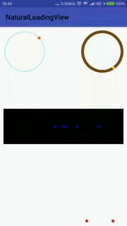

 # NaturalLoadingView

Natural-looking LoadingView for Android
----------



How to use
----------

**1.to include naturalloadingview to your project:**

add the dependency to the the app level build.gradle file

```gradle
dependencies {
	compile 'com.jaren.naturalloadingview:NaturalLoadingViewLib:1.0.1'

}

```
	
**2.Add naturalloadingview in your xml layout:**

  ```xml
    <com.jaren.naturalloadingviewlib.AccelerateTranslationView
        android:layout_width="wrap_content"
        android:layout_height="wrap_content"
        android:layout_alignParentBottom="true"
        nlv:dotColor="#ff0000"
        nlv:dotNum="5"
        nlv:dotRadius="4dp"
        nlv:period="3000">
    </com.jaren.naturalloadingviewlib.AccelerateTranslationView>
```

Naturalloadingview has the following xml attributes
----------
You can customize the look and behavior of the `naturalloadingview` in xml. Use the following attributes in xml.

 **1.AccelerateCircularView**

- `ringColor`
- `ringWidth`
- `globuleColor`
- `globuleRadius`
- `cycleTime`

 **2.AccelerateCircularView**

- `dotColor`
- `dotRadius`
- `dotNum`
- `period`

Example
----------
[Examples](https://github.com/qkxyjren/NaturalLoadingView/tree/master/app)

Change log
---------

License
----------

    Copyright 2017 jaren

    Licensed under the Apache License, Version 2.0 (the "License");
    you may not use this file except in compliance with the License.
    You may obtain a copy of the License at

       http://www.apache.org/licenses/LICENSE-2.0

    Unless required by applicable law or agreed to in writing, software
    distributed under the License is distributed on an "AS IS" BASIS,
    WITHOUT WARRANTIES OR CONDITIONS OF ANY KIND, either express or implied.
    See the License for the specific language governing permissions and
    limitations under the License.
